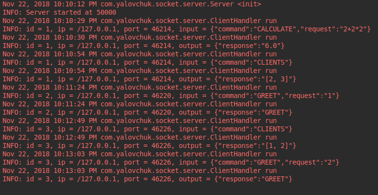

### Socket

Client-server application for communication by sockets.
<br>
_Server_ can serve multiple clients in different threads.
<br>
_ClientHandler_ holds thread specific information, for example, message id.
<br>
Package _calculator_ contains _Server'_ business logic: calculating result of numeric expression
implemented by reverse polish notation.
<br>
There are _Main_ classes in each module. Clients send requests and receive responses by sockets.
_Server_ logs data.
#### Commands
* Calculate arithmetic expression ```{"command":"CALCULATE","request":"2+2*2"}```
* Get another clients (ids) ```{"command":"CLIENTS"}```
* Greet with another client by id =```{"command":"GREET","request":"1"}```

### Quick start
* $ cd {project_folder}
* mvn clean install
* start _Server_ ```$ java -jar server/target/server-1.0-SNAPSHOT.jar```
* start any number of _Clients_ ```$ java -jar client/target/client-1.0-SNAPSHOT.jar```
#### Screenshots:



